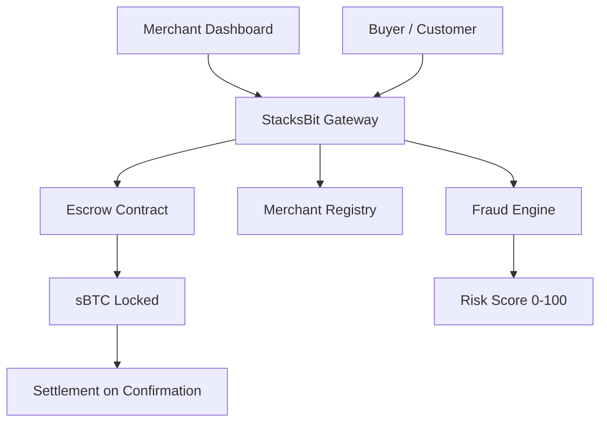
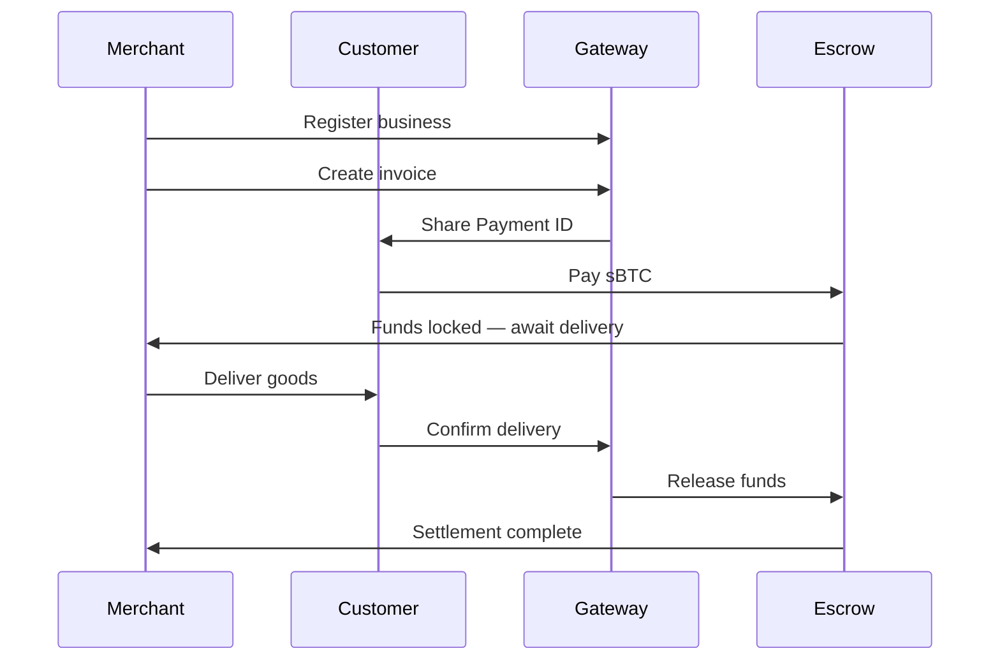
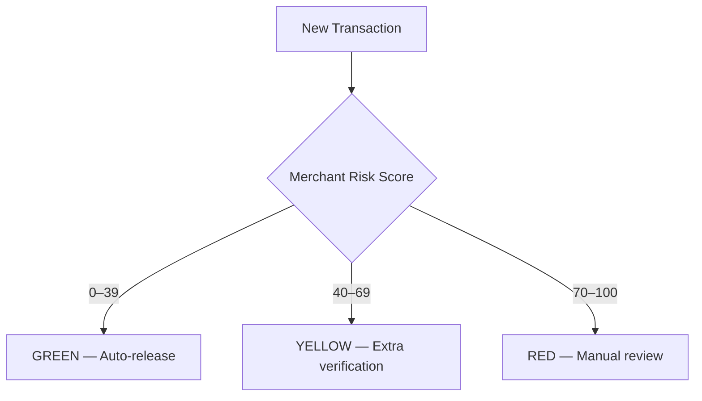
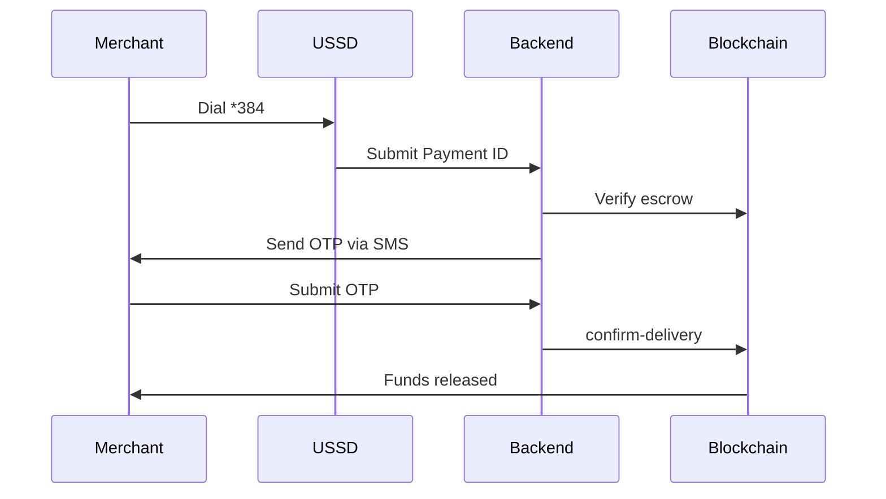

# StacksBit

**Fraud-protection infrastructure for African commerce — built on Stacks (Bitcoin L2)**

> "Send money first and pray" is how most online commerce works in Nigeria today.  
> Buyers get scammed by fake vendors. Merchants get scammed by fake buyers.  
> Both sides lose. Every day. With no recourse.  
>
> StacksBit fixes this.

---

## What StacksBit Is

StacksBit is **not** a payment gateway. It is a **trust layer**.

Payment is the mechanism. Fraud protection is the point.

When a buyer pays through StacksBit, funds lock in a Bitcoin-secured smart contract escrow. Neither party can access them until delivery is confirmed. The merchant cannot run off with the money without delivering. The buyer cannot claim non-delivery after receiving goods. Both sides are protected by code, not by trust.

---

## The Problem — Validated With Real Merchants

Through the Stacks Foundry Validate program (5-week structured validation), we interviewed and ran pilot sessions with merchants in Jos, Plateau State, Nigeria:

- **Every merchant confirmed** experiencing payment fraud or buyer disputes
- **Every merchant resolves disputes manually** — through banks, bank statements, or legal authorities
- **Every merchant said yes** to a system that holds payment until delivery is confirmed
- **Two merchants independently asked** the same unprompted question: *"What does the customer need to do?"* — confirming the pain runs **both directions**

The reframe that emerged from validation:

> StacksBit is not a merchant tool with a buyer side.  
> It is bilateral fraud protection where both sides have equal skin in the game.

---

## How It Works

```
Merchant creates invoice → Customer pays into escrow → Funds locked on-chain
→ Merchant delivers → Customer confirms → Funds released automatically
→ Dispute? Funds stay locked until resolved
```

Nobody cheats. Nobody disappears. Both sides are protected.

---

## Architecture



---

## Payment Flow



---

## Fraud Detection Engine



Signals monitored: dispute rate, delivery time, refund history, repeat customers, transaction volume.

---

## Offline USSD Confirmation — Phase 2

For low-connectivity regions where merchants cannot access the internet reliably:



> USSD layer is in development (Phase 2). Africa's Talking API integration planned.

---

## Current State

### Smart Contracts — Live on Stacks Testnet

| Contract | Address |
|----------|---------|
| stacksbit-gateway | ST3GTDAAVRPKHCC45FFW0540MPTDHGWWRMB5DS4Q0 |
| stacksbit-escrow | ST3GTDAAVRPKHCC45FFW0540MPTDHGWWRMB5DS4Q0 |
| stacksbit-merchants | ST3GTDAAVRPKHCC45FFW0540MPTDHGWWRMB5DS4Q0 |
| stacksbit-fraud-v3 | ST3GTDAAVRPKHCC45FFW0540MPTDHGWWRMB5DS4Q0 |
| sbtc | ST3GTDAAVRPKHCC45FFW0540MPTDHGWWRMB5DS4Q0 |

**Full payment lifecycle verified on-chain:**  
`register-merchant → create-payment-request → pay-invoice → confirm-delivery → dispute`

### Frontend — Live

- **Live app:** https://stacksbit-react.vercel.app
- **GitHub (frontend):** https://github.com/rogersterkaa/stacksbit-react
- Built in React + TypeScript (Vite)
- Mobile-functional via Leather wallet dapp browser
- Role-based UI — merchants and buyers see different navigation
- Separate merchant and buyer wallet slots — two-sided transactions work

### What Works Today

- ✅ Merchant registration (on-chain)
- ✅ Payment request creation with real Payment ID display
- ✅ Escrow payment locking (buyer pays into contract)
- ✅ Delivery confirmation (funds release to merchant)
- ✅ Dispute flow (funds held pending resolution)
- ✅ On-chain transaction history
- ✅ Fraud risk scoring display
- ✅ Mobile UI via Leather dapp browser
- ✅ Role-based merchant/buyer entry point

### In Development (Phase 2)

- 🔧 USSD offline confirmation (Africa's Talking API)
- 🔧 NGN settlement via Paystack
- 🔧 AI fraud detection layer
- 🔧 Mainnet deployment

---

## Validation Evidence

Validated through **Stacks Foundry Validate** (5-week structured program, Q2 2026):

| Actor | Type | Signal |
|-------|------|--------|
| Donald Aondoakura (Errandboy Logistics, Jos) | Merchant | Completed walkthrough, asked "what do I do next?" |
| Elias Ahile (Brisk Global, Jos) | Merchant | Multiple follow-up calls, asked about dispute resolution time |
| Jaram Comfort Mayat (LiveBetter Fashion, Jos) | Merchant | Confirmed fraud pain, willing to adopt |
| Lucy Ejembi | Buyer | Opened app independently, explored flow without prompting |
| Tristan Linardos (Lorica) | Ecosystem | Sustained architectural engagement, open channel |
| Parth Goel | Web3 Builder | Deep technical feedback on escrow/reputation architecture |

**Decision from Validate Week 5:** Refine wedge held, product needs to catch up.  
**Next test:** Complete a live two-sided transaction with Donald and Elias using the new mobile-ready frontend.

---

## Tech Stack

| Layer | Technology |
|-------|-----------|
| Smart contracts | Clarity (Stacks) |
| Settlement asset | sBTC |
| Frontend | React + TypeScript (Vite) |
| Wallet | Leather (via @stacks/connect) |
| Deployment | Vercel |
| AI tools | Stacks MCP Server (Claude Desktop) |

---

## Related Repos

- **Frontend:** https://github.com/rogersterkaa/stacksbit-react
- **Stacks MCP Server:** https://github.com/rogersterkaa/stacks-mcp-server

---

## Builder

**Terkaa Tarkighir (Rogers)**  
Blockchain developer — Jos, Plateau State, Nigeria  
📧 rogersterkaa@gmail.com  
🐙 github.com/rogersterkaa  
🔗 stacksbit-react.vercel.app

---

## Hire Me

Need a custom MCP server or blockchain integration for your project?

I build on Stacks, Clarity, React, and Node.js — and I have hands-on experience shipping real escrow infrastructure to testnet.

📧 rogersterkaa@gmail.com