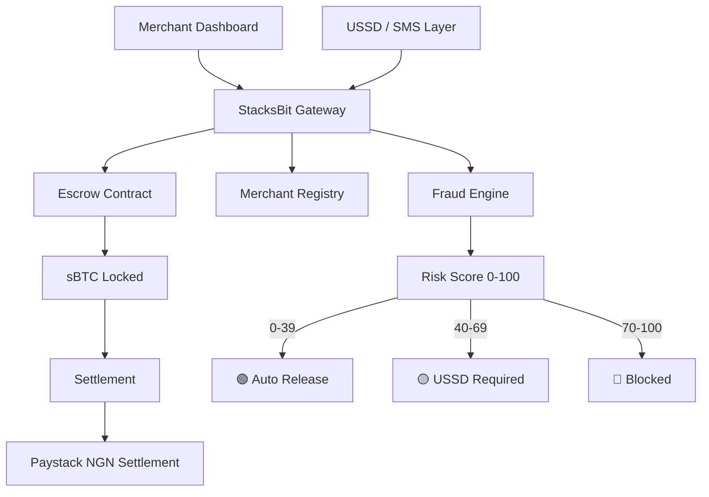
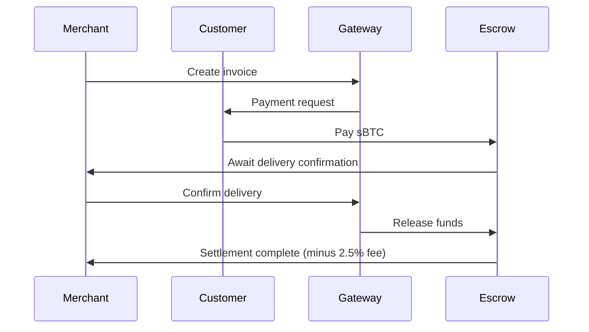
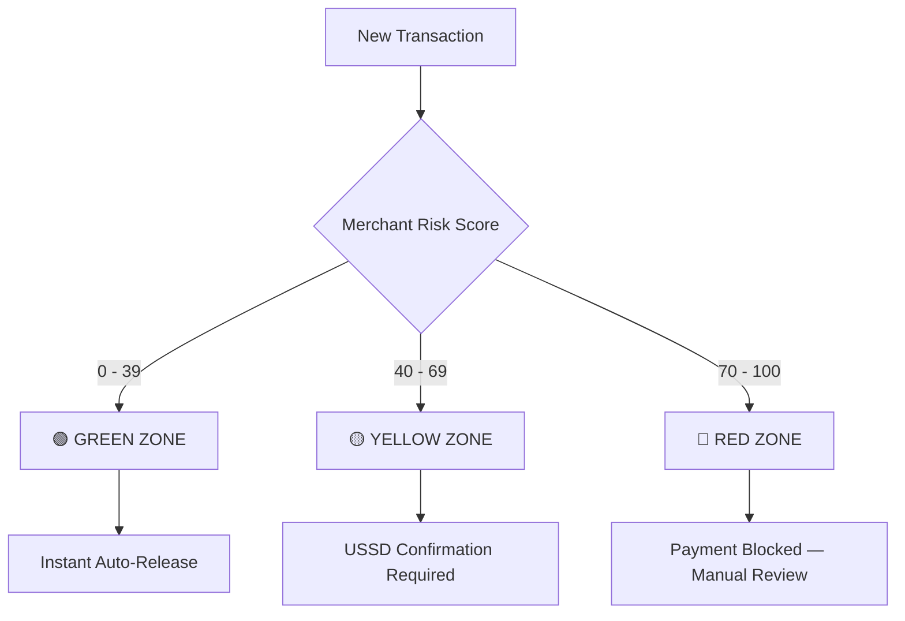
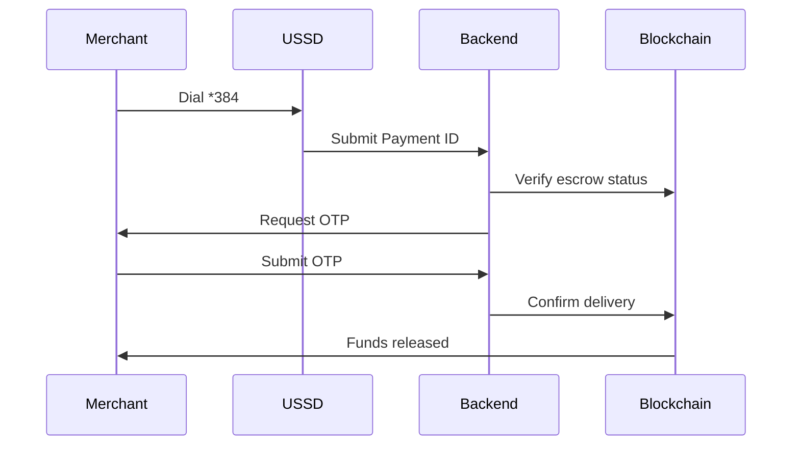

# StacksBit — Bitcoin Payment Gateway for African Merchants

> Trustless Bitcoin payments with smart contract escrow, fraud detection, and offline USSD confirmation — built on Stacks (Bitcoin L2)

[](https://stacksbit-app.vercel.app)
[](https://explorer.hiro.so)
[](../../USER/Downloads/main_readme (5).md#)
[](../../USER/Downloads/LICENSE)

---

## 🌍 Problem

African merchants face three critical barriers to Bitcoin adoption:

- **Trust** — No escrow mechanism for online commerce
- **Fraud** — No reputation system for new merchants
- **Connectivity** — No offline payment confirmation for low-connectivity regions

## 💡 Solution

StacksBit is a non-custodial Bitcoin payment gateway that solves all three:

- **Smart contract escrow** — Funds locked on-chain until delivery confirmed
- **AI Fraud Detection Layer** — On-chain merchant reputation scoring (0–100 risk score)
- **Offline USSD confirmation** — Delivery confirmed via SMS on any phone, no internet needed

---

## 🏗️ System Architecture



---

## 💳 Payment Flow



---

## 🛡️ Fraud Detection Engine



**Scoring factors:**
- Dispute rate (rolling 30-day window)
- New merchant penalty (< 5 payments = +20 risk)
- First interaction risk (+15 for new customer-merchant pairs)
- Payment spike detection (10x average = +25 risk)
- Score decay — reputation recovers over time

---

## 📱 Offline USSD Confirmation Flow



No internet required. Works on any phone in Nigeria.

---

## ✅ Live on Stacks Testnet

| Contract | Address |
|----------|---------|
| `stacksbit-gateway` | `ST3GTDAAVRPKHCC45FFW0540MPTDHGWWRMB5DS4Q0.stacksbit-gateway` |
| `stacksbit-merchants` | `ST3GTDAAVRPKHCC45FFW0540MPTDHGWWRMB5DS4Q0.stacksbit-merchants` |
| `stacksbit-escrow` | `ST3GTDAAVRPKHCC45FFW0540MPTDHGWWRMB5DS4Q0.stacksbit-escrow` |
| `stacksbit-fraud-v3` | `ST3GTDAAVRPKHCC45FFW0540MPTDHGWWRMB5DS4Q0.stacksbit-fraud-v3` |
| `sbtc` (mock token) | `ST3GTDAAVRPKHCC45FFW0540MPTDHGWWRMB5DS4Q0.sbtc` |

**31 unit tests passing. Full end-to-end payment flow verified on-chain.**

---

## 🚀 Getting Started

### Prerequisites
- [Clarinet](https://github.com/hirosystems/clarinet)
- [Node.js](https://nodejs.org) v18+
- [Leather Wallet](https://leather.io)

### Run Smart Contract Tests

```bash
git clone https://github.com/rogersterkaa/StacksBit.git
cd StacksBit
clarinet test
```

### Run Frontend Locally

```bash
git clone https://github.com/rogersterkaa/StacksBit-Frontend.git
cd StacksBit-Frontend
npm install
npm run dev
```

Open `http://localhost:5173` and connect your Leather wallet.

---

## 📁 Project Structure

```
StacksBit/
├── contracts/
│   ├── stacksbit-gateway.clar       # Main orchestration contract
│   ├── stacksbit-gateway-v2.clar    # Updated gateway with settlement types
│   ├── stacksbit-merchants.clar     # Merchant profiles & payment records
│   ├── stacksbit-escrow.clar        # Trustless escrow engine
│   ├── stacksbit-fraud-v3.clar      # AI fraud detection & reputation
│   ├── sbtc.clar                    # Mock sBTC SIP-010 token
│   └── sip-010-trait.clar           # SIP-010 token standard
├── tests/                           # 31 unit tests
└── README.md
```

---

## 🔗 Links

- **Live Demo**: [stacksbit-app.vercel.app](https://stacksbit-app.vercel.app)
- **Frontend Repo**: [github.com/rogersterkaa/StacksBit-Frontend](https://github.com/rogersterkaa/StacksBit-Frontend)
- **Explorer**: [View contracts on Hiro Explorer](https://explorer.hiro.so/address/ST3GTDAAVRPKHCC45FFW0540MPTDHGWWRMB5DS4Q0?chain=testnet)

---

## 👨‍💻 Author

**Terkaa Tarkighir (Rogers)**
- GitHub: [@rogersterkaa](https://github.com/rogersterkaa)
- Email: rogersterkaa@gmail.com
- Location: Lagos, Nigeria

---

## 📄 License

MIT License — see [LICENSE](../../USER/Downloads/LICENSE) for details.
